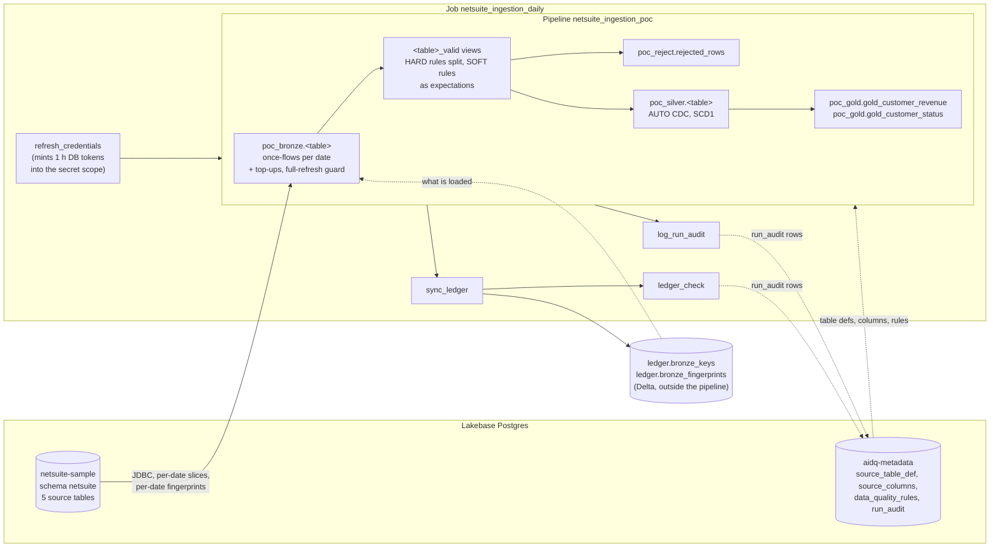

# netsuite_ingestion (POC)

Metadata-driven bronze / DQ / silver / gold pipeline on Databricks (Lakeflow Spark Declarative Pipelines,
serverless) for the five NetSuite sample tables. Which tables are loaded, which columns, how (full or
incremental) and which data-quality rules apply all come from the `aidq_metadata` control tables in Lakebase
Postgres; the code has no table list of its own.

## Architecture



## Metadata-driven design

| Control table | Drives |
|---|---|
| `source_table_def` | one row per source table: `dest_schema`, `business_key`, `watermark_col` (blank = FullLoad, set = Incremental), `bronze_watermark` (start floor), `load_mode` |
| `source_columns` | the columns bronze reads, in `ordinal` order (`is_active` filters) |
| `data_quality_rules` | per table: `rule_expr` (SQL boolean), `severity` HARD (reject) or SOFT (expectation metric only), `is_active` |
| `run_audit` | written, not read: one row per (job run, table, layer) plus a `guard` row per run |

Adding a table, a column or a rule is a metadata change, not a code change. Code tolerates metadata that is one
migration behind (for example a missing `is_active` counts as active), so migrations can go first and code second.

## Layers

**Bronze** (`transformations/bronze.py`). FullLoad tables are batch tables overwritten on every run. Incremental
tables are one append-only streaming table each, with `_snapshot_date` and `_loaded_at`, fed by `once=True`
append flows planned at graph build (`metadata.plan_flows`):

* a **snapshot flow** per source date at or above the floor, named `<table>__<YYYYMMDD>`; a flow that already ran
  is not run again, so each date loads once, including a new date older than the current maximum;
* a **top-up flow** for late rows on an already-loaded date. Detection is by key, never by row count: Postgres
  computes one **fingerprint per date** (count of distinct `(business_key, date)` pairs plus the sum of a 60-bit
  md5-derived bigint per pair), the ledger stores the same numbers, and pairs are fetched only for dates whose
  fingerprints differ. The flow is named after a hash of the pending key set
  (`<table>__<YYYYMMDD>__topup_<hash>`), so a stale ledger reproduces the same name and does not load twice.
  The fingerprint is computed three ways (Postgres SQL, Spark SQL, Python reference); `tests/test_fingerprints.py`
  pins it and `tests/test_fingerprint_integration.py` (`NETSUITE_INTEGRATION=1`) proves the three agree.

**The key ledger.** `<catalog>.ledger.bronze_keys (table_name, business_key, snapshot_date)` and
`<catalog>.ledger.bronze_fingerprints` are plain Delta tables **outside** the pipeline, because a pipeline
cannot read its own tables at graph build or inside a flow. `sync_ledger` appends what bronze holds after every
run; `ledger_check` compares ledger and bronze both ways, prints `WARN` and writes a `ledger` row to `run_audit`
on any mismatch (it never fails the job). Recovery: `sync_ledger --bronze-rebuild true`.

**DQ** (`transformations/dq.py`). HARD rules build one validity predicate per table: passing rows form the
streaming view `<table>_valid`, failing rows go to `poc_reject.rejected_rows` with the failed rule names. SOFT
rules are attached to `<table>_valid` with `dp.expect_all`: rows are kept and violations appear as expectation
metrics in the pipeline event log. `tools/check_soft_expectations.py` confirms every active SOFT rule is there
and prints its passed / failed counts.

**Silver** (`transformations/silver.py`). AUTO CDC (SCD Type 1) from `<table>_valid`, keyed on `business_key`
and sequenced by `watermark_col`, for every table with both (all but `netsuite_customers`, a FullLoad).

**Gold** (`transformations/gold.py`, SQL in `gold_sql.py`). Materialized views over silver, defined only when the
silver tables they need exist:

| Table | Grain | Columns |
|---|---|---|
| `poc_gold.gold_customer_revenue` | customer x calendar month of the transaction date | `transaction_count`, `line_count`, `revenue` (sum of line `amount`) |
| `poc_gold.gold_customer_status` | customer with any membership or certification | `active_memberships`, `active_certifications`, `has_active_*`, `next_*_end`, `as_of_date` |

A membership is active when its status is `Active` and today lies within `[start_date, end_date]`; a
certification when today lies within its start and end dates (a NULL bound is open). The SQL is plain enough to
run on DuckDB, where `tests/test_gold_sql.py` checks it.

## The ingestion redesign and its experiments

**v1** loaded bronze as one view per source date (`poc_bronze.<table>__<date>`) and silver as a streaming union of
those views. It worked for full refreshes but a normal incremental run with a new date **failed every silver flow**
("streaming sources added or removed"): the union changed shape.

**v2** gives each incremental source one streaming table fed by `once` flows, so silver's streaming source never
changes. Experiments on scratch pipelines (`baseline/once_flow_experiments.md`) established what this runtime
does:

* `once` flows accept JDBC batch reads, do not re-run on normal updates, and a new date loads only its slice;
  a flow removed from code keeps its data; a full refresh re-runs every flow.
* A pipeline cannot read its own tables at graph build or inside a flow, hence the external ledger. An anti-join
  against that ledger works.
* Defining flows is the cost, not running them: about 0.43 s per flow (1,600 flows = about 12 min per update
  even when none run), so the default `flow_scope=pending_only` defines flows only for dates missing from the
  ledger plus top-ups (13x faster than `all_dates`).
* A streaming table with no flow fails the update, so an empty constant-named `<table>__anchor` flow is defined
  when nothing else is.
* A full refresh in `pending_only` left every bronze table empty (measured). No Spark conf reveals a full refresh,
  but the pipeline's own event log does (`create_update.full_refresh` / `full_refresh_selection`), which made the
  full-refresh guard possible.

### Baseline results: v1 vs v2

Same source data and defect configuration (seed 42, 2,005 injected defect rows), no agents running. v1 ran in
prod, v2 in dev. Details: `baseline/before_agents_report.md` (v1) and `baseline/before_agents_report_v2.md` (v2).

| | v1 (per-date views) | v2 (streaming bronze + ledger) |
|---|---|---|
| B: defects, full refresh | silver 2,451 / 1,952 / 9,902 / 29,710; 54 rejects | identical, and identical outcome for all 2,005 defect rows |
| C: increment, normal run (223 late rows, drift column) | **failed**: all four silver flows stopped, silver unchanged | **succeeded**: all 223 late rows reached silver |
| D: second increment, late rows onto loaded dates | not run | **succeeded** via top-up flows; bronze = source row-for-row in every table |
| `run_audit` bronze counts | over-counted by 2 to 3 rows per table (leftover objects) | exact |
| Full refresh without `bronze_rebuild=true` | would empty bronze | blocked by the guard, bronze unchanged |

Silver counts are memberships / certifications / transactions / transaction_lines. What the DQ rules catch did not
change: they only catch what they cover (invalid enums and a certification date cutoff are rejected; negative
amounts, amount mismatches, orphan lines and invalid transaction types pass; duplicate and NULL keys are merged
away by the key merge).

## Operating rules

* **Normal runs are never a full refresh.**
* **A full refresh must set `bronze_rebuild=true`, and this is enforced.** At graph build `bronze.py` reads the
  update's `create_update` event from the pipeline's own event log and raises if it is a full refresh (or a
  selective refresh naming a bronze table) without the flag. With the flag it ignores the ledger, defines a flow
  for every date and no top-ups. The error message gives the exact commands:
  `bundle deploy --var bronze_rebuild=true`, `bundle run netsuite_ingestion_daily --pipeline-params
  full_refresh=true`, `bundle deploy --var bronze_rebuild=false` (prod adds `--var schedule_pause_status=PAUSED`).
* The guard fails closed: if the event cannot be read it refuses to run in `pending_only` scope. The event log is
  written asynchronously, so the read retries 5 times 10 s apart. **How many reads it needed is recorded**: the
  pipeline writes `poc_bronze.guard_reads` on every update and `log_run_audit` copies it to `run_audit` as a
  `guard` row (`rows_read` = reads; status `OK` on a first-read hit, `WARN` otherwise) and prints it in the task
  output, so a platform slowdown shows before it blocks updates.
* `flow_scope`: `pending_only` (default) or `all_dates` (a flow for every source date, slow; small date counts only).
* Never `DROP` a `poc_bronze` table outside Lakeflow: silver's streaming checkpoint fails with
  `DIFFERENT_DELTA_TABLE_READ_BY_STREAMING_SOURCE`; only a full refresh recovers.
* No production deploy or run without the owner's approval (see `CLAUDE.md`).

## Guard canary

`guard_canary_check` (weekly, Mondays 07:00 UTC, **schedule PAUSED**) runs a tiny pipeline with the same guard code
through a normal update, a full refresh, a selective refresh and a normal update. It fails unless normal updates
complete, both refreshes are blocked and the canary table is untouched (a fail-closed block counts as a warning).
A failure means the platform changed how refreshes appear in the event log: fix the guard before the next full
refresh. Run it with `databricks bundle run guard_canary_check -t <target>` after stopping the SQL warehouse.

## Known limitations

**Data**

* **Source deletes are not handled.** A row deleted (or moved to another date) in the source stays in bronze, the
  ledger and silver; nothing removes it.
* Two source rows with the same `(business_key, updated_date)` cannot be told apart: a late duplicate of an
  already-loaded pair is never captured.
* Rows whose watermark is NULL, or older than the floor, are never extracted.
* Every normal run reads the distinct `(business_key, date)` pairs of each incremental source to find late rows;
  this scales with source size. Late pairs are capped (200,000 per table), beyond that the run fails and asks for
  a `bronze_rebuild` full refresh.
* The ledger lags by one run and depends on `sync_ledger`; a failed sync is what `ledger_check` warns about.
* `netsuite_customers` is a FullLoad with no silver table, so gold is keyed by `customer_internal_id` only (no
  company name). `source_columns` still omits its `created_date` / `updated_date`.
* DQ rules catch only what they describe (see the baseline table above). SOFT rules never block anything.
* `gold_customer_status` is recomputed on every update (it depends on today's date).
* A blank `watermark_col` means FullLoad today; converting blanks to NULL is planned as migration 003.

**Databricks Free Edition**

* **One Lakebase project per account.** This account already has two (`netsuite-sample`, `aidq-metadata`), so no
  further project can be added; dev and prod metadata are two branches of one project, and the source is shared by
  dev and prod.
* A Lakebase project holds at most 10 unarchived branches. The generator creates a backup branch before every data
  change (`--init`, `--increment`), so branches must be cleaned up regularly.
* All Lakebase endpoints were found **disabled** on 2026-09-30, a few days after the last activity (disabled
  around 2026-09-27; cause not confirmed, most likely an inactivity policy). A job run fails until the endpoint is
  re-enabled (`databricks postgres update-endpoint ... spec.disabled`).
* At most 5 concurrent job tasks, and a small serverless quota: a running SQL warehouse plus a pipeline update plus
  job tasks can fail with `RESOURCE_EXHAUSTED`. Stop the warehouse before the canary or back-to-back runs.
* No account console or account-level APIs: no OIDC federation for CI (CI uses an OAuth M2M service principal).
* A catalog cannot be created through the API on Default Storage, so dev uses schemas in catalog `workspace`.
* Lakehouse Federation to Postgres supports only username/password, and native Postgres login is disabled on both
  projects, so all reads go over JDBC with short-lived OAuth database tokens (about 1 hour, refreshed by
  `refresh_credentials` at the start of every run).

## Environments and CI/CD

`dev` writes to schemas in the `workspace` catalog (`poc_bronze`, `poc_silver`, `poc_reject`, `poc_gold`, `ledger`,
`canary`) and reads the `dev` branch of `aidq-metadata`; `prod` writes to `poc_netsuite` and reads its
`production` branch. Both read the same `netsuite-sample` source. CI/CD (pull request checks, deploy to dev on
merge, canary, gated promotion to prod) is described in `docs/phase2_cicd_plan.md`; the current state of the
work is in `docs/STATUS.md`.

## Layout

```
databricks.yml                                   bundle config (targets dev / prod, variables)
resources/                                       pipeline, job, guard canary
src/netsuite_ingestion/metadata.py               JDBC readers, pure builders, bronze planning, guard
src/netsuite_ingestion/gold_sql.py               gold SQL (engine-neutral, tested on DuckDB)
src/netsuite_ingestion/transformations/          bronze.py, dq.py, silver.py, gold.py
src/netsuite_ingestion/{refresh_credentials,sync_ledger,ledger_check,log_run_audit}.py   job tasks
src/netsuite_ingestion/canary/                   guard canary pipeline and task
tools/netsuite_gen.py, tools/pg_writer.py        synthetic data generator for the source
tools/check_soft_expectations.py                 SOFT rules vs. pipeline event log
migrations/                                      aidq_metadata schema migrations
baseline/                                        v1 and v2 baselines, once-flow experiments
tests/                                           pytest (no Spark or database needed)
```

## Running tests, deploying, checking

```bash
python -m venv .venv
.venv/Scripts/python -m pip install ".[dev,tools]"     # .venv/bin/python on Linux/macOS
.venv/Scripts/python -m pytest
git config core.hooksPath .githooks                     # pre-push: gitleaks + pytest

databricks bundle validate -t dev --profile <PROFILE>
databricks bundle deploy -t dev --profile <PROFILE>                         # prod needs the owner's approval
databricks bundle run netsuite_ingestion_daily -t dev --profile <PROFILE>
python tools/check_soft_expectations.py --pipeline-id <PIPELINE_ID> --meta-branch dev --profile <PROFILE>
```

Contribution rules (branches and pull requests, no force-push, what must never be committed, no prod deploy
without approval) are in `CLAUDE.md`.
